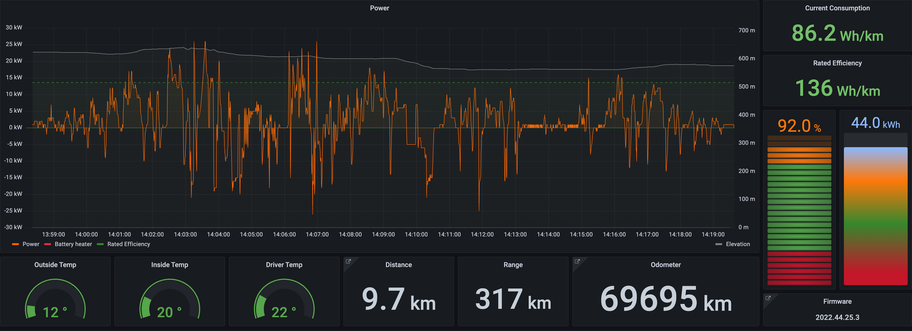
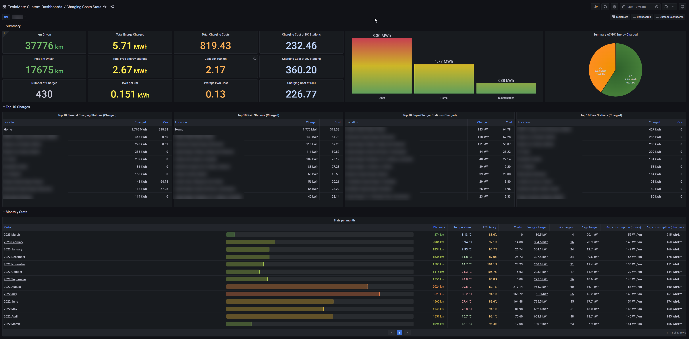

# TeslaMate Custom Grafana Dashboards

This is a repository with custom **Grafana Dashboards**, created especially to work with a Teslamate installation.

## TeslaMate

**[Teslamate](https://docs.teslamate.org/)** is a powerful, self-hosted data logger for your Tesla.

- Written in **[Elixir](https://elixir-lang.org/)**
- Data is stored in a **Postgres** database
- Visualization and data analysis with **Grafana**
- Vehicle data is published to a local **MQTT** Broker

## How to import these custom boards

For Teslamate 1.2x or upper

1. On Grafana (from Teslamate instance), Browse Dashboards then Import...
2. Upload JSON file or import via panel json by pasting the raw content of te JSON file.
3. On the next screen you may name the dashboard as you wish or accept the suggested one.
4. Try to keep UID as it is, because it could be linked inside the dashboard and to avoid duplicates UIDs.
5. Then select the appropiate Teslamate datasource from the available droplist.
6. Finally, press the "Import" button

## Screenshots

### [Current Drive View v1.3](./dashboards/CurrentDriveView.json)

This is a special dashboard to load while driving. When you open this dashboard it will show the last 15 minutes, but you should click the "Current Drive" button at the top right corner, to enter in Kiosk mode:

- If you are driving, you will see the information from the start time of the current drive until now and it will refesh automatically every 30 seconds.
- If you are just browsing (not driving) you will see the information of the last drive.  

### [Current Charge View v1.1](./dashboards/CurrentChargeView.json)

Load this dashboard to while you are in a charging sesion. When you open this dashboard it will show the last 15 minutes, but you should click the "Current Charge" button at the top right corner, to enter in Kiosk mode:

- If you are charging, you will see the information from the start time of the current charge session until now and it will refesh automatically every 30 seconds.
- If you are just browsing (not charging) you will see the information of the last charge session.  

Tip: Be aware that once this dashboard is imported you should edit and change the image panel with a GIF of your own, because the charging car you will see is mine :-)

### [Charging Costs Stats v1.4](./dashboards/ChargingCostsStats.json)

This dashboard is meant to have a look of all the charges in a given period (last 10 years by default).
You can see the distance driven, number of charges, total charging cost, etc., both in summary or in
separated lists.

You can expand/collapse the rows as needed.

From the Monthly Stats row, you will have a table with links to other Teslamate Dashboards to have a look on a specific period, charge or trip.

### [Charging Curve Stats v1.1](./dashboards/ChargingCurveStats.json)

This dashboard is meant to have a look of the charging curve sessions on Supercharges or other Fast Charging Station. Also, you can see number of fast charging sessions you've done on each type of chargers and the count of max power (kW) reached on a session as shown in the following example.

### [Battery Health v1.6](./dashboards/BatteryHealth.json)

This dashboard is meant to have a look of the Battery health based on the data logged in Teslamate. So, the more data you have logged from your brand new car the better.
Be aware that this information is just a calculation to have a reference, measured after every > 5kWh charged and a monthly average based on the projected range.

### [Tracking Drives v1.2](./dashboards/TrackingDrives.json)

This dashboard is meant to analize a drive based on a date you select, then you can pass the pointer over the lines in graph
to see data details and a blue point in the map tranking the route. With this option you can analized a specific point location in the map,
to see the speed, power, SOC, elevation and if battery heater was on.

Be aware that the drive you select in the dropdown list from the top could be outside the time range of the Timeline graph,
if its the case you have to click on the "Zoom to data" button on the graph in order to update it.

Tip: On Grafana you can press "h" to get a keyboard shortcuts if you want to change the current Zoom out time range or use the mouse to select/change the time range.

## Contributing

If you are able to contibute with more Custom Grafana Dashboards just fork this repository and make a pull request. I'll really apreciate any improvement or suggestion.

## Credits

- Author: [Juan Carlos Heredia](https://infoinnova.net/contacto/)
- Based on/forked from [Adrian Kumpf](https://github.com/adriankumpf/teslamate) original code, with improvement of custom Grafana Dashboards (see [contributions history](https://github.com/jheredianet/Teslamate-CustomGrafanaDashboards/graphs/contributors)).

## License

Licensed under the [MIT license](./LICENSE).
